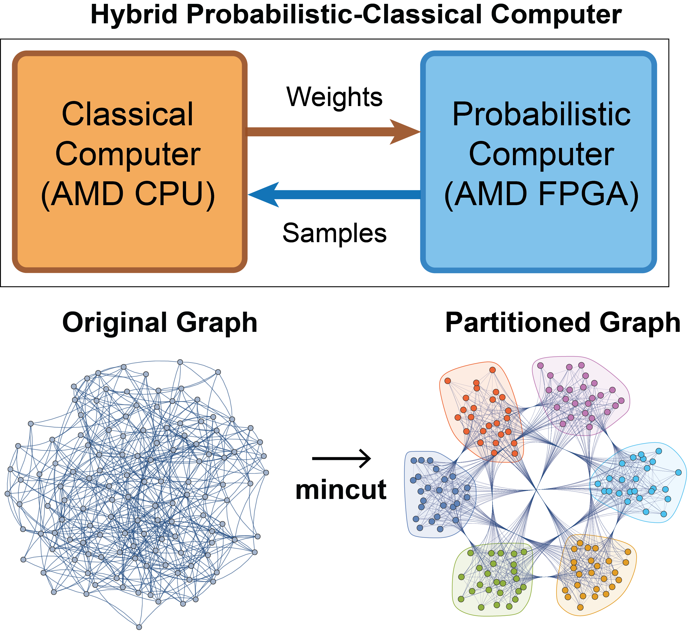

# Towards Extreme Scaling of Ising Machines with Distributed p-Computers
**Navid Anjum Aadit, and Kerem Y. Camsari**  
Department of Electrical and Computer Engineering, University of California, Santa Barbara, CA 93106, USA

## Summary
Probabilistic computing with p-bits offers scalable, room-temperature solutions for optimization and ML. While sMTJ p-computers may scale to millions of p-bits [1], today’s practical emulators on FPGAs are limited by single-device resources (~10k–20k p-bits). We present a **distributed p-computer** architecture that partitions large Ising graphs (KaHIP/METIS) across multiple FPGAs and communicates asynchronously, leveraging the error tolerance of probabilistic algorithms. Our prototype attains ~**3000 flips/ns** with ~**100k p-bits**, achieving performance competitive with or exceeding GPU/TPU Ising machines.

**Key idea.** Treat many FPGAs as one virtual p-computer by graph partitioning and low-overhead inter-FPGA exchange. Solution quality matches the monolithic ideal and extends to ML workloads and quantum-inspired algorithms.

**References.**  
[1] K.Y. Camsari *et al.*, Phys. Rev. X 7 (2017), 031014.  
[2] N.A. Aadit *et al.*, Nat. Electron. 5 (2022), 460–468.  
[3] S. Niazi *et al.*, Nat. Electron. (2024), 1–10.  
[4] N. Nikhar *et al.*, Nat. Commun. 15 (2024), 8977.

---

## What’s in this repository
- **MATLAB demos (CPU & FPGA):**
  - `matlab/gset_maxcut/CPU_MaxCut_GSET.m` and `FPGA_MaxCut_GSET.m` (GSET Max-Cut, G81).
  - `matlab/spin_glass/CPU_EA3D.m` and `FPGA_EA3D.m` (EA 3D spin glass, L=37).
  - Minimal instance files and color maps to run immediately.
- **Custom RTL (hardware/rtl):** p-bit, weight, RNG (LFSR / xoroshiro), serialization, pack/unpack, readout, and package modules.
- **Constraints (hardware/constraints):** board-level XDC.
- **(Optional) Block Design Tcl (hardware/bd/bd_export.tcl):** Vivado “Write Block Design Tcl”.
- **Prebuilt bitstreams:** see **Releases** for six FPGA bitstreams.

---

## Quick start (MATLAB, CPU-only)
1. Open MATLAB.
2. `cd matlab/gset_maxcut`
3. Run `CPU_MaxCut_GSET.m` (plots Cut Value vs. time, with max-cut reference line).
4. `cd ../spin_glass` and run `CPU_EA3D.m` (plots residual energy vs. time, with ground line).

> Each CPU demo runs in seconds and requires no hardware.

---

## Quick start (MATLAB → FPGA demo)
> Requires your FPGA boards on the private 192.168.0.x network (as in the paper demos) and MATLAB AXI Manager support.

1. Ensure the six boards are powered, cabled, and reachable (e.g., `ping 192.168.0.1`, …, `.6`).
2. Download the **six bitstreams** from this repo’s **Releases** page.
3. Program the boards (Vivado hardware manager or your standard loader workflow).
4. In MATLAB:
   - `cd matlab/gset_maxcut`
   - Run `FPGA_MaxCut_GSET.m`
   - The script sets up AXI Managers, pushes weights/bias, steps the schedule, and plots **Cut Value vs. time**.
5. For the spin-glass demo:
   - `cd ../spin_glass`
   - Run `FPGA_EA3D.m` (plots **Residual Energy vs. time**).

If a board doesn’t respond, the scripts will retry limited times and stop with a clear error.

---

## Rebuild notes (optional)
- If you wish to recreate the block design, use Vivado **Tools → Write Tcl…** to export your design as `hardware/bd/bd_export.tcl`. Running that Tcl in Vivado (with the same Vivado version and required licensed IPs) reconstructs the block design.
- The RTL in `hardware/rtl/` are the custom modules used in our p-computer pipeline. Vendor IP is **not** included.

---

## Folder map
- `matlab/gset_maxcut/` — MATLAB Max-Cut demo, instance, color map, and images.
- `matlab/spin_glass/` — MATLAB EA 3D demo, instance, ground energies, color map.
- `matlab/common/` — shared MATLAB helpers (fixed-point, adjacency, retries).
- `hardware/rtl/` — custom SystemVerilog RTL for the p-computer.
- `hardware/constraints/` — XDC.
- `hardware/bd/` — optional BD Tcl.

---

## License
All source code is released under the **BSD-3-Clause** license (see `LICENSE`).  
The project report is © the authors.  
Binary bitstreams are provided for evaluation only.

---
