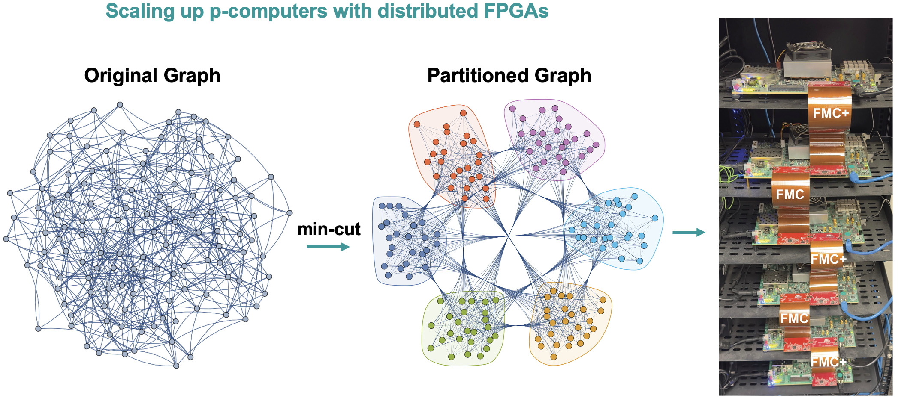

# Towards Extreme‑Scale Ising Machines with Distributed p‑computers

**Authors:** Navid Anjum Aadit, Kerem Y. Camsari  
**Affiliation:** Department of Electrical & Computer Engineering, University of California, Santa Barbara, CA 93106, USA

<p align="center">
  
</p>

<p align="center">
  
</p>


Probabilistic computing with p‑bits provides a scalable, room‑temperature path for hard optimization and ML workloads. Single‑FPGA p‑computers already outperform mainstream accelerators on several probabilistic tasks, but capacity is capped per device (~10k p‑bits on large FPGAs). This repository demonstrates a **distributed architecture** that partitions large graphs across multiple FPGAs and communicates **asynchronously** between subgraphs. In our demos, a **6‑FPGA** system reaches **50–60k p‑bits** and **up to ~900 billion flips/s**, and the approach scales with additional boards or custom silicon.

---

## Highlights
- **Scale & performance.** Multi‑FPGA execution with ~10k p‑bits/FPGA; six boards reach the **50–60k p‑bit class** with **hundreds of billions of flips/s** and clean growth with additional boards.
- **Implementation end‑to‑end.** MATLAB demos (CPU baselines + FPGA runs) with a unified UI, example bitstreams, and lean SystemVerilog RTL for the core p‑computer micro‑architecture.  
- **Innovation & scalability.** Asynchronous, error‑tolerant updates enable high throughput and natural scaling from a handful of FPGAs to larger farms or ASIC/sMTJ p‑computers.  
- **Algorithms & partitioning.** Supports **KaHIP/METIS** and a **probabilistic Potts‑style cut** that can be **distance‑aware** to penalize long inter‑FPGA cuts; keeps cross‑partition traffic small.
- **Reusability.** BSD‑3‑Clause licensed building blocks (MATLAB + RTL) and **ready bitstreams** for two demo workloads so others can reproduce and adapt quickly.

---

## Repository Structure 
- `matlab/` – MATLAB demos for **Spin Glass** and **GSET Max‑Cut** (CPU+FPGA)
- `hardware/rtl_example/` – core SystemVerilog modules actually used in the demos
- `hardware/constraints_example/` – one example XDC for pin assignments
- `hardware/BD_example/` – minimal Vivado block design export (`bd_export.tcl`, wrapper, and a short note)
- `bitstreams/` – example ready‑to‑flash images (per‑FPGA) for both demos
- `report/` – project report (PDF)
- `images/` – figures used in README 
- `LICENSE` – BSD‑3‑Clause

---

## Requirements
**Software**
- MATLAB **R2024b or later**
- MATLAB **Ethernet AXI Manager** (for FPGA runs)
- Xilinx **Vivado 2024.1 or later** (for rebuilding bitstreams, if desired)

**Hardware**
- **Six VCU118** FPGA boards (tested) on the same network (examples assume static IPs `192.168.0.{1..6}`; adjust in code if different)
- **Five FMC and FMC+ cables**

> **Color maps**, **ground energies**, and **partitions** (KaHIP/METIS/Potts) are included for the provided instances.

---

## Quick Start (MATLAB)

Both demos follow the same flow: open the CPU script → click **run CPU** → click **run FPGA** when ready. The FPGA script reuses the same figure and overlays as the CPU.

### 1) 3D Spin Glass (EA3D, L=37)
1. In MATLAB, set the repo root as the working folder.
2. Run:
   ```matlab
   matlab/spin_glass/CPU_EA3D.m
   ```
3. Click **run CPU** in the figure to start the baseline.
4. Click **run FPGA** to launch the FPGA run from the same UI.

**Files (subset)**  
- `matlab/spin_glass/instances/size37/JOrig_0000.mat` – instance (10 instances are given)   
- `matlab/spin_glass/Ground_energies/energyData_L=37.txt` – ground energy  
- `matlab/spin_glass/colorMap/L37_colorMap.mat` – color map  
- `matlab/spin_glass/optimal_partitions/optimal_potts_partitions_target_L37_6parts_*.mat` – distance‑aware Potts partitions  
- `matlab/common/*.m` – shared helpers (fixed‑point, adjacency indexing, robust read/write)

### 2) GSET Max‑Cut (G81)
1. Run:
   ```matlab
   matlab/gset_maxcut/CPU_MaxCut_GSET.m
   ```
2. Click **run CPU** in the figure.
3. Click **run FPGA** to start the FPGA run.

**Files (subset)**  
- `matlab/gset_maxcut/GSET/G81.txt` – instance 
- `matlab/gset_maxcut/colorMap/G81_colorMap.mat` – color map  
- `matlab/gset_maxcut/optimal_partitions/optimal_metis_partitions_G81_6parts.mat` – partitions  
- `matlab/common/*.m` – shared helpers

---

## Bitstreams
Example images are provided in:
```
bitstreams/
├─ spin_glass/
│  ├─ fpga1.bit
│  ├─ fpga2.bit
│  └─ ...
└─ gset_maxcut/
   ├─ fpga1.bit
   ├─ fpga2.bit
   └─ ...
```
Filenames correspond to the board index (1–6).

---

## RTL (Core Architecture)
The demo RTL is intentionally **lean** and focused on the p‑computer micro‑architecture actually used here:

```
hardware/rtl_example/
├─ top.sv
├─ pbit.sv
├─ weight.sv
├─ LUT_bias.sv
├─ PSL_pkg.sv
├─ LFSR_n.sv              
├─ pack_pbits.sv
├─ unpack_pbits.sv
└─ pbits_FPGA3.txt        // example p‑bit instantiation list consumed by top.sv
```
- Example constraint: `hardware/constraints_example/constraints.xdc`

---

## Block Design (optional)
`hardware/BD_example/` contains a minimal export for portability:
- `bd_export.tcl` – Vivado block design TCL
- `BRAM_write_regs_wrapper.vhd` – small wrapper used in the BD
- `MATLAB_IP_note.txt` – short note on the MATLAB AXI Manager IP

This folder is illustrative; it is not required to use the provided bitstreams.

---

## Reuse
- **MATLAB side:** Change instances, load color maps, and partitions to explore different problems and sizes.  
- **RTL side:** The modules are generic building blocks for probabilistic computing and can be adapted to other fabrics or loaders.  
- **Scaling:** ~10k p‑bits/FPGA today; ~60k on six boards; architecture extends naturally to industry‑scale.

---

## License
**BSD‑3‑Clause** — see `LICENSE`.

---

## References
[1] N. A. Aadit *et al.*, “Massively parallel probabilistic computing with sparse Ising machines,” **Nature Electronics**, 5(7):460–468, 2022.  
[2] N. Nikhar *et al.*, “All‑to‑all reconfigurability with sparse and higher‑order Ising machines,” **Nature Communications**, 15:8977, 2024.  
[3] S. Niazi *et al.*, “Training deep Boltzmann networks with sparse Ising machines,” **Nature Electronics**, 7(7):610–619, 2024.  
[4] S. Chowdhury *et al.*, “A full‑stack view of probabilistic computing with p‑bits: Devices, architectures, and algorithms,” **IEEE JXCDC**, 9(1):1–11, 2023.  
[5] N. A. Aadit *et al.*, “Accelerating Adaptive Parallel Tempering with FPGA‑based p‑bits,” **IEEE VLSI Technology & Circuits**, 2023.  
[6] M. H. Sajeeb *et al.*, “Scalable connectivity for Ising machines: Dense to sparse,” **Physical Review Applied**, 24(1):014005, 2025.
